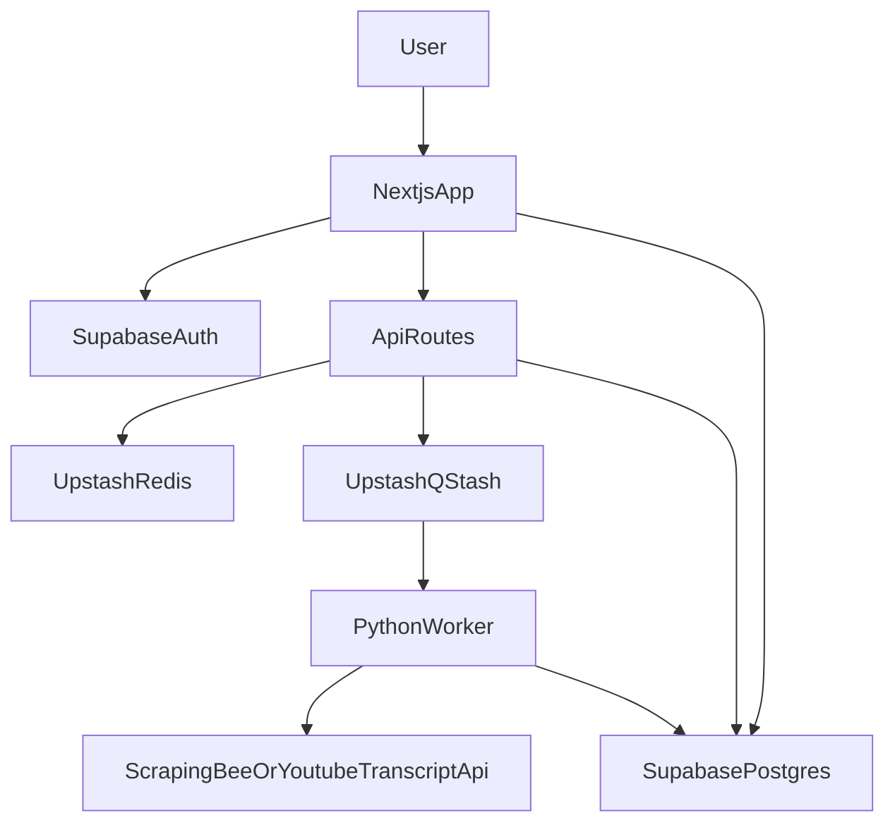

# YouTube Transcript SaaS Development Plan

## Scope And Goals

- Build the MVP in 12 weeks with transcript extraction, user auth, dashboard, caching, rate limits, and Stripe billing.
- Defer AI summaries, batch processing, and API tier to Phase 2 as documented.
- Keep costs within the $143 recommended budget until launch.

## Core Architecture

- **Frontend:** Next.js 14 (App Router), TypeScript, Tailwind, shadcn/ui, Zustand. Deployed on Vercel.
- **API Gateway:** Next.js API routes (Node.js 20+) for auth checks, rate limiting, billing webhooks, and queue publishing.
- **Workers:** Python 3.11 + FastAPI (or Flask) on Cloud Run to process transcript extraction with a waterfall strategy.
- **Data:** Supabase Postgres + Supabase Auth; Upstash Redis for caching + rate limiting; optional Supabase Storage for exports.
- **Queue:** Upstash QStash for async job dispatch from Next.js to Python workers.

## Data Model (Supabase)

Reference schema in `[c:\Users\trash\Downloads\youtube-saas-quick-start-guide.md](c:\Users\trash\Downloads\youtube-saas-quick-start-guide.md)`:

- `users` (managed by Supabase Auth; include `subscription_tier`, `stripe_customer_id`)
- `transcripts` (unique `video_id`, `language`, `content`, `text_blob`, `created_at`)
- `ai_summaries` (phase 2)
- `request_logs` (usage tracking, provider, cost)

## System Flow (MVP)

## Phased Delivery Plan

### Phase 1: MVP (Weeks 1–12)

**Month 1 — Foundation**

- **Week 1: Setup & Planning**
  - Initialize Next.js 14 + TypeScript + Tailwind + shadcn/ui.
  - Create Supabase project, configure Auth.
  - Connect Vercel for CI/CD and preview deployments.
  - Deliverable: Landing page deployed with basic routing.
- **Week 2: Authentication**
  - Build signup/login pages with Supabase Auth.
  - Create a protected dashboard shell and authenticated routing.
  - Set up environment variables and secrets handling.
  - Deliverable: Users can sign up and access dashboard.
- **Week 3: Local Scraping Prototype**
  - Stand up Python service (FastAPI/Flask) for transcript extraction using `youtube-transcript-api`.
  - Validate extraction on local dev with test URLs.
  - Deliverable: Local API returns transcript payloads reliably.
- **Week 4: Frontend Integration**
  - Create transcript input UI and result display with copy-to-clipboard.
  - Connect Next.js to Python API for end-to-end flow.
  - Basic error handling and empty/loading states.
  - Deliverable: Paste URL → transcript displayed end-to-end.

**Month 2 — Core Features**

- **Week 5: Dashboard**
  - Transcript history with thumbnails and search.
  - Account settings and usage overview.
  - Deliverable: Functional dashboard for history and account.
- **Week 6: Database & Caching**
  - Implement Supabase schema and persist transcript results.
  - Add Upstash Redis cache with hit/miss logic.
  - Deliverable: Transcripts persist; cache reduces extraction calls.
- **Week 7: Reliability Waterfall**
  - Integrate ScrapingBee as primary or fallback based on cost policy.
  - Add retries with exponential backoff.
  - Deliverable: 95%+ success rate.
- **Week 8: Rate Limiting & Usage**
  - Implement quotas (Free: 5/day; Pro: unlimited).
  - Record usage in `request_logs`.
  - Deliverable: Rate limits enforced and tracked.

**Month 3 — Payments & Launch**

- **Week 9: Stripe Integration**
  - Create product/plan ($9/mo) and checkout flow.
  - Webhooks for `payment_succeeded`, `subscription_deleted`.
  - Sync subscription tier in Supabase.
  - Deliverable: Users can upgrade and access Pro limits.
- **Week 10: Polish & QA**
  - Improve UX: loading, error states, help/FAQ.
  - Add Sentry (or similar) for error tracking.
  - Deliverable: Production-ready quality.
- **Week 11: Beta**
  - Onboard 10–20 users; collect feedback.
  - Fix critical bugs quickly.
  - Deliverable: MVP validated with real users.
- **Week 12: Soft Launch**
  - Publish demo video and launch posts.
  - Monitor analytics and errors.
  - Deliverable: Public launch with first users.

### Phase 2: Growth Features (Months 4–6)

- Add AI summaries (Gemini 3 Flash), multilingual support, exports.
- Add “Chat with Transcript” (RAG), batch processing, analytics dashboard.
- Add API tier and multi-channel search.

### Phase 3: Scale & Enterprise (Months 7–12)

- Developer API + webhooks, team workspaces, advanced analytics.
- Enterprise tier: SLAs, white-label, sales outreach.

## Testing Strategy

- Unit tests for extraction helpers and rate-limiting logic.
- Integration tests for API → worker → DB flow.
- Webhook tests for Stripe events.

## Risks And Mitigations

- **Scraping reliability:** Use ScrapingBee early; keep fallback for dev/testing.
- **Cost blowup:** Strict quotas and caching; track per-request cost in `request_logs`.
- **Rate-limit bypass:** Enforce limits in API gateway, not client.

## Deliverables Checklist

- MVP deployed on Vercel with Auth + Dashboard.
- Worker service deployed on Cloud Run with queue-based processing.
- Redis caching and rate limiting active.
- Stripe billing live with Pro tier.

## Reference Source

- Project requirements and roadmap are derived from `[c:\Users\trash\Downloads\youtube-saas-quick-start-guide.md](c:\Users\trash\Downloads\youtube-saas-quick-start-guide.md)`.

